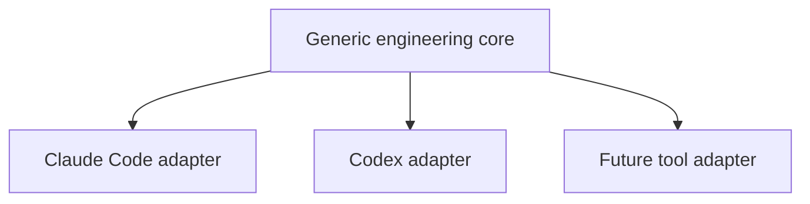
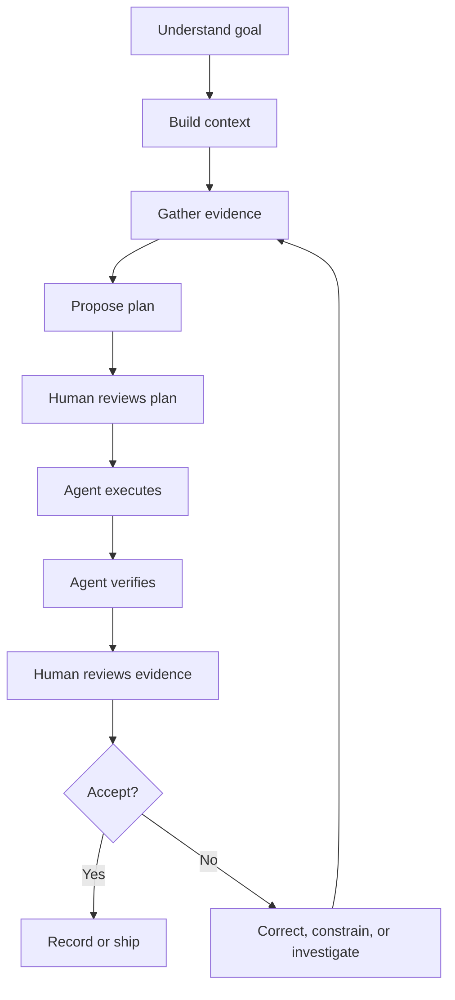
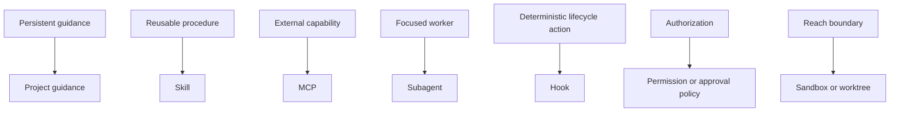

# Generic Agentic Coding Course Plan v2

**Recommended title:** **Control the Coding Agent**  
**Subtitle:** A tool-independent engineering course with Claude Code and Codex guides  
**Status:** Refined, source-backed implementation plan  
**Current course:** [Control the Agent](https://mrgkumar.github.io/agentic-coding/course/)  
**Builds on:** `COURSE_BEGINNER_GAP_REMEDIATION_PLAN_V1.4.md`  
**Reviewed:** 21 August 2026

---

## 1. Goal

Convert the current Claude Code course into a generic agentic-coding course that teaches durable engineering judgment and remains directly usable with both:

- **Claude Code**
- **OpenAI Codex**

The course must teach one shared workflow, then translate that workflow into each product's commands, configuration files, and control surfaces.



### Core outcome

After completing the course, a learner can supervise a coding agent without depending on one vendor's command vocabulary.

They can:

1. build relevant context;
2. investigate before changing code;
3. separate evidence from assumptions;
4. review a bounded plan;
5. define observable completion conditions;
6. control permissions and isolation;
7. verify behavior and review the diff;
8. accept or reject the result;
9. preserve state across long-running work;
10. translate those practices into Claude Code or Codex.

---

## 2. Canonical design decision

Do **not** teach Claude Code and Codex side by side in every sentence. That would double labels, increase cognitive load, and make the core lesson age as quickly as both products.

Use three layers:

```text
LAYER 1 — SHARED PRINCIPLE
What engineering problem are we solving?

LAYER 2 — SHARED PATTERN
What action or evidence solves it?

LAYER 3 — PLATFORM ADAPTER
What is this called in Claude Code or Codex today?
```

Example:

| Layer | Content |
|---|---|
| Principle | Long sessions accumulate stale and noisy context. |
| Pattern | Inspect usage, compact useful state, or start a fresh session. |
| Claude Code | `/context`, `/compact`, `/clear` |
| Codex | context meter or `/status`, `/compact`, or a new chat |

### Recommended learner experience

The landing page asks:

> Which coding agent are you using?

Options:

- Claude Code
- Codex
- Show both
- Generic concepts only

The selection changes platform notes and examples. It must not create separate copies of the course or separate progress histories.

---

## 3. Relationship to the beginner-remediation plan

This v2 plan **incorporates** the beginner changes from v1.4:

- explicit prerequisites;
- minimal LLM foundation;
- a complete first-task walkthrough;
- model limitations and uncertainty;
- a context-stack explanation;
- a task-contract pattern;
- persistent glossary;
- constructed-response exercises;
- cumulative retrieval checks;
- a complete capstone with implementation evidence;
- learner validation;
- accessibility and deployment gates.

Use this v2 document as the canonical course direction. Keep v1.4 as the detailed beginner-gap audit and evidence record.

---

## 4. Audience and prerequisites

### Primary audience

Software engineers who understand source files and automated tests but may have no prior LLM or coding-agent experience.

### Secondary audience

Technical managers, scientists, product managers, and designers can follow the conceptual path. Repository exercises may require assistance.

### Explicit non-goal

The course will not teach programming, Git, JavaScript, package managers, or terminal use from first principles.

Landing-page text:

> No prior LLM, Claude Code, or Codex experience is required. Basic familiarity with software projects, source files, and automated tests is recommended.

---

## 5. The product-neutral operating model

Use this as the central diagram across the course:



### Terminology rules

Use the following terms in the generic core:

| Preferred generic term | Avoid as the only term | Reason |
|---|---|---|
| Project guidance | `CLAUDE.md` or `AGENTS.md` | Filenames are adapter details |
| Path-scoped guidance | Rules | “Rules” means different things across products |
| Command approval rule | Rules | Distinguishes authorization from guidance |
| Completion condition | `/goal` | The concept survives command changes |
| Recurring check | `/loop` | Codex may express recurrence through scheduled tasks |
| Independent review | `/review` or `/code-review` | Exact command differs |
| Start fresh | `/clear` | Surface-specific behavior differs |
| Branch conversation | `/branch` or `/fork` | Exact command differs |
| Restore checkpoint | `/rewind` | Recovery capabilities differ |
| Persistent learned context | Auto memory or memories | Product storage and semantics differ |
| Parallel agent | Agent team | Team coordination is not identical across products |

### Important collision: “rules”

This must be explicit in the course:

- In Claude Code, `.claude/rules/` can mean modular, path-scoped project instructions.
- In Codex, command rules control which commands may run outside the sandbox.

Never present “Rules” as a portable feature name. Teach the two underlying responsibilities separately.

---

## 6. Portability model

Classify every concept before adding it to the course.

| Class | Meaning | Examples | Treatment |
|---|---|---|---|
| A — Durable principle | Independent of product | evidence, scope, verification, human acceptance | Required core |
| B — Shared pattern | Same responsibility, different UI | project guidance, compaction, review, worktrees | Core + adapter |
| C — Shared feature name | Present in both, semantics may differ | skills, MCP, hooks, subagents, `/goal` | Explain generically; document differences |
| D — Product-specific | No safe one-to-one mapping | Claude `/loop`, output styles, Codex review pane | Optional adapter/reference |
| E — Experimental or changing | Availability or syntax may shift | agent teams, auto-review, advanced automation | Label with maturity and reviewed date |

Rule:

> A product feature enters the required core only when it teaches a durable engineering responsibility.

---

## 7. Claude Code ↔ Codex capability map

This table is a maintained adapter, not the conceptual syllabus.

| Engineering responsibility | Claude Code | Codex | Generic course wording |
|---|---|---|---|
| Start in a repository | `claude` in the project directory or another supported surface | `codex` in the project directory or app/IDE/cloud | Open the agent in the target project |
| First orientation | Ask what the project does | `Tell me about this project` is an official starter task | Orient before changing anything |
| Project guidance | `CLAUDE.md`, `CLAUDE.local.md`, `.claude/rules/` | `AGENTS.md`, nested `AGENTS.md`, `AGENTS.override.md` | Durable and path-specific project guidance |
| Plan without editing | Plan mode or request a plan | `/plan` or plan mode | Separate planning from implementation |
| Long-running completion | `/goal` | `/goal` | Define a verifiable completion condition |
| Time-driven recurrence | `/loop`, scheduled tasks, routines | scheduled tasks/automations | Use recurrence only for time- or event-driven work |
| Inspect context/session state | `/context` | context indicator and `/status` | Inspect the working state |
| Compress long history | `/compact` | `/compact` and automatic compaction | Preserve signal; reduce stale history |
| Start fresh | `/clear` or new session | new chat | Start a clean context when the task changes |
| Resume | `/resume` | `codex resume` or resume from the app | Continue the same coherent task |
| Branch reasoning | `/branch` | `/fork` | Preserve the original while exploring an alternative |
| Restore work | `/rewind` plus Git | Git checkpoints/revert and product recovery controls | Use recoverable checkpoints; Git remains durable history |
| Verification | tests/build/screenshots; optional `/verify` | tests/build/screenshots and explicit verification request | Give the agent observable checks |
| Independent code review | bundled review skill or review workflow | `/review`, review pane, GitHub review | Review diff and risks independently of implementation |
| Permissions | permission modes and permission rules | approval policy/permissions | Decide when an action needs authorization |
| Isolation | Bash sandbox, containers, worktrees | OS sandbox modes, network controls, worktrees | Limit what actions can reach |
| Reusable workflow | skill | skill | Package repeatable knowledge and procedure |
| External tools/data | MCP | MCP | Connect only trusted external capabilities |
| Focused delegation | subagent | subagent | Isolate bounded research or specialist work |
| Parallel edit isolation | worktrees/background sessions | worktrees/separate chats | Separate file-writing work |
| Lifecycle automation | hooks | hooks | Run deterministic checks at lifecycle events |
| Distribution | plugins/marketplaces | plugins/marketplaces | Package reusable capabilities |
| Response presentation | output styles | response/personality preferences and instructions | Optional response shaping; not project policy |
| Persistent learned context | auto memory | memories | Learned context is not an enforcement boundary |

### Accuracy rule

Do not imply exact equivalence merely because both products use the same word. For each adapter item, document:

- responsibility;
- current product mechanism;
- important semantic difference;
- official source;
- last-reviewed date.

---

## 8. Revised ten-module course

Preserve the existing ten-module structure and the shopping-calculator narrative.

### 00 — Start

**Shared core**

- Course promise and prerequisites
- Readiness check
- Platform selection
- Full, quick, and reference modes
- “The agent executes; the engineer owns acceptance”

**Adapter content**

- How to open the selected product
- Optional link to its installation/quickstart guide
- No installation is required for the static course

### 01 — From LLM to Coding Agent

**Shared core**

1. Minimal LLM mental model
2. LLM → assistant → agent
3. Complete first-task walkthrough
4. Agent loop: context → decide → tool → evidence
5. Working-context stack
6. Uncertainty, missing context, non-determinism, and drift
7. Attention and finite-context behavior

**Platform example tabs**

Claude Code:

```text
What does this project do? Summarize the runtime and test command.
Do not edit anything.
```

Codex:

```text
Tell me about this project. Summarize the runtime and test command.
Do not edit anything.
```

The difference in wording is intentionally small. The lesson is that both agents must inspect the repository through tools before their claims become grounded.

### 02 — Build Context

**Shared core**

- Orient → Map → Locate → Trace → Constrain → Summarize
- Task contract:
  - Goal
  - Context
  - Constraints
  - Evidence
  - Done when
  - Stop/ask conditions
- Context is curated evidence, not volume

**Platform adapter**

- Claude Code: `CLAUDE.md`, context inspection, file references
- Codex: `AGENTS.md`, `@` file context where available, session status

### 03 — Investigate Before Editing

Rename the existing module from **Research Before Editing** to **Investigate Before Editing**. “Research” can imply web research; this lesson is primarily repository diagnosis.

**Shared core**

- Reproduce the problem
- Independently calculate or state expected behavior
- Trace the current behavior
- Separate:
  - KNOWN
  - INFERRED
  - ASSUMED
  - UNVERIFIED
- Identify root-cause evidence
- Stop when a product decision is missing

No platform-specific command is required. The same prompt works in both tools.

### 04 — Plan the Change

**Shared core**

- A plan is a reviewable route, not a wish list
- Smallest coherent change
- Files, behavior, preserved constraints, risks, and verification
- Human approval before material implementation
- Construct a plan, do not only recognize one

**Adapter content**

- Claude Code: plan mode or explicit planning request
- Codex: `/plan` or plan mode

### 05 — Control Execution

Rename the central comparison:

```text
PLAN       How should the work proceed?
GOAL       What observable condition ends the work?
SCHEDULE   When should another check or run begin?
```

Then show adapters:

| Concept | Claude Code | Codex |
|---|---|---|
| Plan | Plan mode | `/plan` / plan mode |
| Goal | `/goal` | `/goal` |
| Schedule | `/loop`, scheduled tasks, routines | scheduled tasks/automations |

Do not make `/loop` part of the generic title or learning objective.

### 06 — Verify, Review, and Accept

**Shared core**

```text
Agent says done
   ↓
Verification evidence
   ↓
Independent review
   ↓
Human acceptance decision
```

Require review of:

- goal/requirement;
- diff;
- tests and other checks;
- scope;
- risks;
- unresolved uncertainty.

**Adapter content**

- Claude Code: run checks, inspect diff, optionally use verification/review skills
- Codex: run checks, use `/review` or the review pane, inspect the diff

### 07 — Extend and Constrain the Agent

Replace the current Claude-specific extension map with responsibilities:



Teach these as shared concepts:

- project guidance;
- skills;
- MCP;
- subagents;
- hooks;
- plugins;
- permissions/approvals;
- sandboxing;
- worktree isolation.

Place output styles, response personalities, agent teams, and vendor-specific rule systems in adapters or advanced reference sections.

### 08 — Manage Long-Running Work

**Shared core**

- one coherent task per session/chat;
- inspect context pressure;
- compact useful history;
- start fresh when the task changes;
- resume the same task;
- create a structured handoff;
- branch reasoning without losing the original;
- use Git for durable source history;
- isolate parallel edits with worktrees;
- use subagents for bounded, noisy work.

**Adapter cards**

Show exact commands only after the learner chooses a product.

### 09 — Cross-Platform Capstone

Use the existing Pulse Monitor problem, but complete the evidence loop.

The learner must:

1. orient the repository;
2. identify the missing warning threshold;
3. write the clarification question;
4. create a bounded plan;
5. define “done when” evidence;
6. translate the goal into the selected product;
7. inspect candidate implementation and tests;
8. detect a boundary or scope issue;
9. accept or challenge with a rationale;
10. create a short handoff.

The grading rubric must be identical across Claude Code and Codex. Only command hints differ.

---

## 9. Platform-neutral examples

Prefer prompts that work without product-specific syntax.

### Orient

```text
Orient this repository first. Summarize its purpose, runtime, test command,
major folders, and the files relevant to the current task. Do not edit anything.
```

### Investigate

```text
Investigate why the fixed-coupon case returns ₹2,160 instead of ₹2,124.
Trace the calculation and separate observations from inferences.
Do not edit yet.
```

### Plan

```text
Propose the smallest coherent plan. Name the files, behavior change,
preserved behavior, risks, and verification. Do not implement until approved.
```

### Execute toward a completion condition

```text
Implement the approved plan. The work is complete when the fixed-coupon case
returns ₹2,124, existing tests pass, percentage discounts and validation remain
unchanged, and the diff contains no unrelated changes.
```

### Verify

```text
Verify the result against the approved plan. Review the diff, tests,
completion evidence, scope, and remaining risks. Do not modify code during review.
```

The adapter may add `/plan`, `/goal`, `/review`, or another supported control, but the semantic content remains visible.

---

## 10. Content and UI architecture

### Platform state

Add one shared state value:

```text
platform = generic | claude | codex | compare
```

Requirements:

- Stored locally with the existing course progress
- Changeable at any time
- Does not reset completion state
- Included in shareable deep links where practical
- Defaults to `generic` when unset

### Adapter rendering

Do not duplicate lesson HTML. Store structured adapter data:

```text
course/src/
├─ content/                    # shared lessons
├─ platforms/
│  ├─ generic.js
│  ├─ claude-code.js
│  └─ codex.js
├─ data/
│  ├─ glossary.js
│  ├─ capability-map.js
│  └─ sources.js
└─ components/
   ├─ platform-note.js
   ├─ platform-picker.js
   └─ compare-table.js
```

Each adapter entry should contain:

```text
concept_id
label
command_or_surface
short_explanation
caveat
official_source
last_reviewed
maturity
```

### Rendering policy

- Generic mode: shared principle and product-neutral prompt only
- Claude Code mode: shared content plus concise Claude note
- Codex mode: shared content plus concise Codex note
- Compare mode: compact table shown after shared content
- Never interleave alternating product names inside the main explanatory paragraph

---

## 11. Migration audit of the current course

The deployed course contains substantial hard-coded Claude terminology, including repeated uses of `Claude`, `CLAUDE.md`, `/loop`, `/context`, `/clear`, `/branch`, `/rewind`, output styles, and agent teams.

Classify each occurrence before changing it:

| Current item | Migration decision |
|---|---|
| “Claude” where it means any acting model | Replace with “the agent” |
| “Claude” where product behavior is specific | Move into Claude adapter |
| “Claude Code course” branding | Rename to generic title and subtitle |
| `CLAUDE.md` | Replace core wording with project guidance; retain in adapter |
| `/goal` | Teach completion condition first; show both adapters |
| `/loop` | Rename core concept to schedule/recurrence; retain in Claude adapter |
| `/verify` | Rename core concept to verification; retain as optional Claude mechanism |
| `/context`, `/clear` | Teach inspect/start-fresh pattern; move commands into adapter |
| `/resume`, `/branch`, `/rewind` | Teach continuity/recovery pattern; map per product |
| output style | Move to optional Claude adapter and compare with Codex response preferences |
| agent team | Replace with parallel-agent concept; keep product-specific coordination details in adapters |
| Claude-specific official links | Store under Claude source registry |
| New Codex documentation links | Store under Codex source registry |

Do not perform blind search-and-replace. Some uses of “Claude” identify real product behavior and must remain correctly attributed.

---

## 12. Implementation work packages

### WP-01 — Extract content and platform data

- Modularize the existing large `app.js` before adding more branches.
- Preserve current output through snapshot/browser checks.
- Add platform adapter schema and tests.

### WP-02 — Neutralize the shared core

- Change branding and learning objectives.
- Rewrite only product-dependent sentences.
- Rename Plan/Goal/Loop to Plan/Goal/Schedule in the core.
- Rename Research Before Editing to Investigate Before Editing.
- Separate the two meanings of “rules.”

### WP-03 — Implement the platform selector

- Add start-page choice and header switcher.
- Add generic, Claude, Codex, and compare modes.
- Preserve one route graph and one progress model.

### WP-04 — Add Claude Code adapter

- Extract existing valid Claude-specific material.
- Cite current official Claude Code documentation.
- Preserve `/goal`, `/loop`, memory, output style, permission, sandbox, hook, subagent, worktree, and session details as adapter/reference content.

### WP-05 — Add Codex adapter

- Add Codex CLI/app/IDE/cloud orientation.
- Add `AGENTS.md`, `/plan`, `/goal`, `/status`, `/compact`, `/fork`, `/review`, approvals, sandbox, skills, MCP, hooks, subagents, and worktrees.
- Do not claim a Codex equivalent when none is documented.

### WP-06 — Implement the beginner foundation

- Apply the v1.4 beginner on-ramp.
- Use the same first-task walkthrough for both platforms.
- Keep attention mathematics optional.

### WP-07 — Upgrade practice and capstone

- Add constructed responses and delayed reveals.
- Use one product-neutral rubric.
- Complete the Pulse Monitor evidence review.
- Require a cross-platform handoff.

### WP-08 — Sources, currency, and release gates

- Add per-adapter `last_reviewed` metadata.
- Check official links automatically.
- Review semantics quarterly or after material product releases.
- Run course checks before GitHub Pages deployment.

---

## 13. Test strategy

### Shared-core tests

- Generic mode contains no unexplained Claude- or Codex-only commands.
- Every required lesson has one product-neutral learning objective.
- Every platform-specific statement is rendered through an adapter or explicitly attributed.
- Existing workflow, Context Ladder, evidence board, plan review, verification, and capstone outcomes remain.

### Adapter tests

- Every capability entry has an official source and reviewed date.
- Claude Code mode renders no Codex-only command as a Claude action.
- Codex mode renders no Claude-only command as a Codex action.
- Compare mode shows both without duplicating the shared lesson.
- The term “rules” always identifies either guidance or command authorization.

### Interaction tests

- Platform selection persists.
- Switching platforms preserves page, answers, drafts, and progress.
- Shared deep links work with and without a platform parameter.
- Copyable prompts contain the selected platform command only when needed.
- Reference search can filter shared, Claude, and Codex entries.

### Content-drift tests

Automated link checking is necessary but insufficient. Add a source report that shows:

```text
concept
product
source
last reviewed
maturity
review overdue?
```

### Learner validation

Test with at least:

- three Claude Code beginners;
- three Codex beginners;
- two learners who switch products during the course.

Targets:

| Outcome | Target |
|---|---:|
| Explains the generic workflow without vendor commands | ≥ 7/8 |
| Completes orientation in selected product | ≥ 7/8 |
| Maps project guidance correctly | ≥ 7/8 |
| Distinguishes guidance rules from approval rules | 8/8 |
| Defines a valid completion condition | ≥ 7/8 |
| Detects flawed capstone evidence | ≥ 7/8 |
| Switches platform without losing conceptual understanding | 2/2 switchers |

---

## 14. Acceptance criteria

### AC-01 — Product neutrality

- The title, hero, module objectives, workflow diagrams, and capstone rubric are product-neutral.
- The course remains meaningful in generic mode.
- No core learning outcome depends on remembering a slash command.

### AC-02 — Accurate adapters

- Claude Code and Codex adapters use current official documentation.
- Differences are stated rather than hidden behind approximate equivalence.
- Experimental or maturity-dependent features are labeled.

### AC-03 — One course, not two copies

- One lesson graph serves all platform modes.
- Shared explanations, interactions, and progress are stored once.
- Platform notes are structured adapter data.

### AC-04 — Beginner readiness

- No prior LLM or agent knowledge is assumed.
- A worked first task precedes attention internals.
- Glossary, first-use definitions, and model-limit lessons are present.

### AC-05 — Engineering transfer

- Learners can perform the workflow in either product.
- The capstone tests evidence, planning, execution control, review, and acceptance.
- Learners can explain why the workflow remains valid if they change tools.

### AC-06 — Existing strengths preserved

- Ten top-level modules remain.
- Shopping Calculator and Pulse Monitor remain the continuous and transfer cases.
- Context Ladder, attention/context content, verification discipline, professional light theme, static architecture, mobile layout, and local progress remain.

### AC-07 — Quality gates

- Unit/content tests pass.
- All platform modes render without errors or horizontal overflow.
- Keyboard and accessibility journeys pass.
- GitHub Pages deployment runs checks first.
- First-time learner targets are met or documented gaps remain open.

---

## 15. Official source registry

Use only official documentation for current product behavior. Research papers can continue to support LLM and instructional-design concepts.

### Claude Code

1. [Overview](https://code.claude.com/docs/en/overview)
2. [Quickstart](https://code.claude.com/docs/en/quickstart)
3. [How Claude Code works](https://code.claude.com/docs/en/how-claude-code-works)
4. [Best practices](https://code.claude.com/docs/en/best-practices)
5. [Memory and CLAUDE.md](https://code.claude.com/docs/en/memory)
6. [Extension overview](https://code.claude.com/docs/en/features-overview)
7. [Skills](https://code.claude.com/docs/en/skills)
8. [Goal mode](https://code.claude.com/docs/en/goal)
9. [Commands](https://code.claude.com/docs/en/commands)
10. [Permission modes](https://code.claude.com/docs/en/permission-modes)
11. [Sandboxing](https://code.claude.com/docs/en/sandboxing)
12. [Hooks](https://code.claude.com/docs/en/hooks)
13. [Subagents](https://code.claude.com/docs/en/sub-agents)
14. [Worktrees](https://code.claude.com/docs/en/worktrees)
15. [Sessions](https://code.claude.com/docs/en/sessions)
16. [Scheduled tasks and `/loop`](https://code.claude.com/docs/en/scheduled-tasks)

### OpenAI Codex

1. [Codex CLI and first task](https://learn.chatgpt.com/docs/codex/cli)
2. [Codex quickstart](https://developers.openai.com/codex/quickstart)
3. [Best practices](https://learn.chatgpt.com/guides/best-practices)
4. [Long-running work and Goal mode](https://developers.openai.com/codex/long-running-work)
5. [Developer commands: `/plan` and `/goal`](https://developers.openai.com/codex/developer-commands)
6. [Custom instructions with AGENTS.md](https://learn.chatgpt.com/docs/agent-configuration/agents-md)
7. [Customization overview](https://learn.chatgpt.com/docs/customization/overview)
8. [Agent approvals and security](https://developers.openai.com/codex/agent-approvals-security)
9. [Sandboxing](https://developers.openai.com/codex/sandboxing)
10. [Hooks](https://developers.openai.com/codex/hooks)
11. [Subagents](https://developers.openai.com/codex/agent-configuration/subagents)
12. [Worktrees](https://developers.openai.com/codex/environments/git-worktrees)
13. [Code review](https://developers.openai.com/codex/code-review)
14. [Glossary](https://developers.openai.com/codex/glossary)

### Shared foundations

- [Effective context engineering for AI agents](https://www.anthropic.com/engineering/effective-context-engineering-for-ai-agents)
- [Building effective agents](https://www.anthropic.com/engineering/building-effective-agents)
- [Cognitive Apprenticeship](https://www.aft.org/ae/winter1991/collins_brown_holum)
- [Fading worked examples in programming education](https://dl.acm.org/doi/10.1145/1288580.1288594)
- [The Power of Testing Memory](https://pubmed.ncbi.nlm.nih.gov/26151629/)

---

## 16. Critique and refinement of this plan

### Rejected approach: two complete tracks

**Problem:** Duplicating every lesson for Claude Code and Codex would cause content drift, inconsistent fixes, and a doubled maintenance burden.

**Refinement:** One shared lesson graph with small structured adapters.

### Rejected approach: generic language only

**Problem:** A fully abstract course would teach principles but leave beginners unable to operate their chosen tool.

**Refinement:** Default to generic concepts, then reveal exact product actions through a selected adapter.

### Rejected approach: feature-by-feature comparison

**Problem:** Learners would memorize product taxonomies before mastering the engineering loop.

**Refinement:** Organize by responsibility: guidance, capability, authorization, isolation, verification, continuity.

### Rejected approach: assume same name means same behavior

**Problem:** Shared labels such as goal, skills, memory, hooks, or rules can hide semantic differences. “Rules” is particularly dangerous because it refers to different responsibilities.

**Refinement:** Maintain responsibility, mechanism, caveat, source, and maturity for every adapter entry.

### Rejected approach: preserve `/loop` as a core concept

**Problem:** `/loop` is a Claude-specific mechanism, while recurrence can be implemented differently in Codex.

**Refinement:** Teach Plan / Goal / Schedule. Put product commands in adapters.

### Rejected approach: rewrite the existing course

**Problem:** The Context Ladder, evidence board, plan critique, verification review, and visual design already work well.

**Refinement:** Extract, neutralize only product-dependent wording, and preserve validated interactions.

### Refined verdict

The course should become:

```text
Durable engineering method
        +
shared interactive cases
        +
selectable product adapters
        +
official source registry
        +
cross-platform learner validation
```

This produces a genuinely generic course while keeping it immediately useful for Claude Code and Codex.

---

## 17. Delivery sequence

1. Preserve the current rendered baseline and tests.
2. Modularize the monolithic course source.
3. Add the platform adapter schema and selector.
4. Neutralize shared terminology without changing lesson behavior.
5. Add the Codex adapter using official OpenAI documentation.
6. Convert existing Claude material into the Claude adapter.
7. Apply the v1.4 beginner foundation.
8. Complete constructed practice and the capstone.
9. Add cross-platform tests, source-age reporting, and deployment gates.
10. Validate with Claude Code beginners, Codex beginners, and product switchers.

Suggested commit sequence:

```text
1. Refactor course content into shared modules
2. Add platform adapter data model
3. Make core course product-neutral
4. Add Claude Code adapter
5. Add Codex adapter
6. Add beginner foundation and glossary
7. Complete cross-platform capstone
8. Gate deployment and verify all modes
```

---

## 18. Definition of done

```text
Generic core is understandable alone
  ↓
Claude adapter is source-accurate
  ↓
Codex adapter is source-accurate
  ↓
Platform switching preserves progress
  ↓
Capstone measures the same judgment in both tools
  ↓
Automated, visual, accessibility, and deployment checks pass
  ↓
First-time learners demonstrate transfer
```

The work is not complete merely because both product names appear in the site. It is complete when learners understand one durable method and can apply it correctly through either tool.
